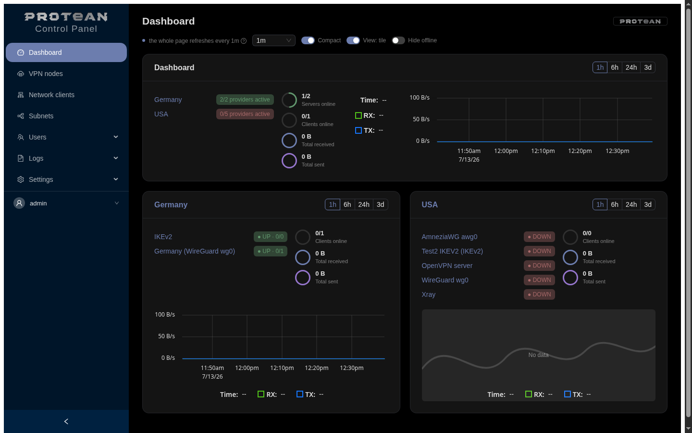
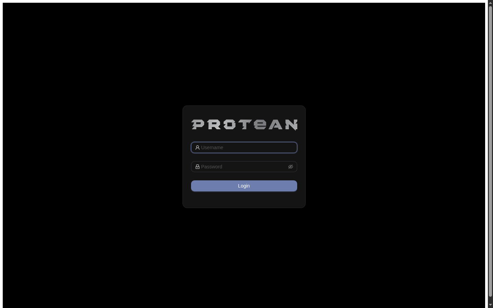
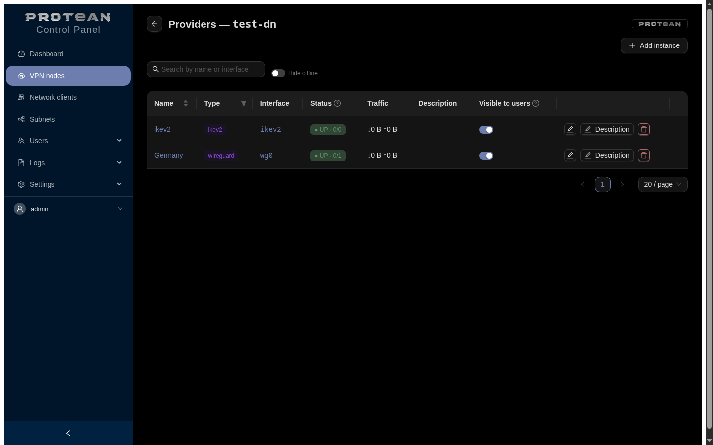
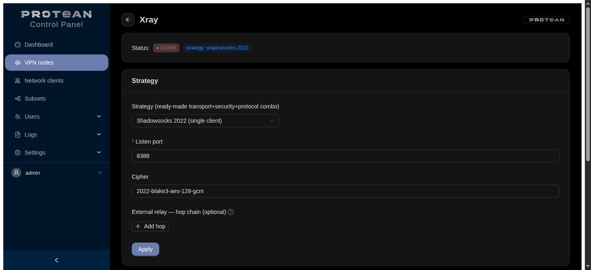
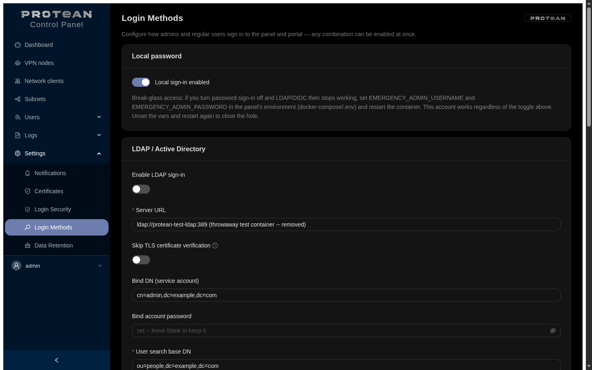

# Protean

[](go.mod)
[](docker-compose.yml)
[](LICENSE)


**English** | [Русский](README.ru.md)

A single web panel for deploying and running VPN infrastructure on your own
VPS: **WireGuard, AmneziaWG, OpenVPN, IKEv2/strongSwan, and Xray**
(DPI-resistant — Reality/VLESS/VMess/Trojan/Shadowsocks) under one UI, with
multiple sites joined into one site-to-site mesh, flexible internet egress
through any node (Xray relay chaining), and self-service access for end
users through a dedicated portal. The name comes from "protean" — able to
take many forms: one tool, very different scenarios, from a plain
site-to-site WireGuard link to multi-hop DPI-resistant egress. Replaces
hand-editing configs and `wg show`/`ipsec status` in a terminal with a
dashboard, forms, and a single "add client" button.

<p align="center">
  
</p>

<details>
<summary>More screens: login, per-server providers, Xray (DPI-resistant), LDAP/OIDC auth</summary>
<p align="center">
  
  
  <br>
  
  
</p>
</details>

## Doesn't require installing a VPN first

The panel does **not require a pre-installed VPN** — it can install
WireGuard/AmneziaWG/OpenVPN/IKEv2/Xray on the target VPS itself, one button
click (see Install below), or manage an already-configured VPN
infrastructure if you've set it up by hand. Either way, the panel runs as
its own Docker container and only ever talks to the host over SSH — no
agent on the host, no direct panel access to the host's network outside
that SSH channel.

## How it works

```
┌─────────────────────────────┐        SSH          ┌─────────────────────────────┐
│   Docker: panel (Go)         │ ───────────────────▶│   Host (the same VPS)        │
│   - React + AntD SPA (API)   │  wg / wg-quick /     │   - wg0 (WireGuard)          │
│   - Postgres (auth, subnets, │    awg / awg-quick / │   - awg0 (AmneziaWG)         │
│     encrypted client         │    systemctl restart │   - /etc/wireguard/wg0.conf  │
│     private keys)            │                      │   - /etc/amnezia/.../awg0... │
└─────────────────────────────┘                      └─────────────────────────────┘
```

- **The config file on the host is the source of truth for VPN state**
  (`wg0.conf`/`awg0.conf`), not the panel's database. The panel reads it
  plus the interface's live state (`wg show <iface> dump`), decides what
  to change, writes the change back into the same file, and applies it
  live via `wg set` (no downtime, the file just stays in sync in case of a
  restart).
- WireGuard itself can't store a client name, so the panel keeps it as a
  `# Name: ...` comment right above the `[Peer]` block — the same trick
  wg-easy/wireguard-ui use.
- Postgres (in an existing container on the host, its own DB/schema
  `wgpanel`) only holds what the conf file can't: panel users, sessions, the
  shared "site subnets" catalog, and client private keys the panel
  generated itself (AES-256-GCM encrypted, key from `SECRET_KEY`) — needed
  to hand out the config/QR again after a client is created.
- VPN backends sit behind one `vpn.Provider` interface
  (`internal/vpn/provider.go`). WireGuard and AmneziaWG are fully
  implemented and share the same code (`internal/vpn/wgfamily`), since
  `awg`/`awg-quick` is a fork of `wg`/`wg-quick` with the same output/config
  format plus obfuscation fields (Jc/Jmin/Jmax/S1/S2/H1-4). **OpenVPN** is a
  full provider: the panel acts as its own CA (Go `crypto/x509`, key
  encrypted in the DB), provisions the server (CA/cert/tls-crypt/conf/
  service) with a "Set up" button, issues client `.ovpn` bundles with
  inline certificates, and routes site subnets via client-config-dir/
  iroute. **IKEv2/strongSwan** is likewise full: its own CA, `swanctl`
  provisioning via "Set up", road-warrior clients with a `.p12` bundle
  (password shown in the UI), status via `swanctl --list-sas`. For both
  certificate-based providers: **certificate revocation (CRL)** — deleting
  a client revokes its cert (OpenVPN `crl-verify`, strongSwan x509crl +
  `swanctl --load-all`), a revoked client can't reconnect; and **CSR
  enrollment** — the client sends a CSR, the panel signs it, the private
  key never leaves the client (the certificate-based equivalent of
  client-side keygen for WireGuard). IKEv2 additionally supports
  **per-client site subnets** (a client-site gets its own swanctl
  connection with `remote_ts` = its LAN, site-to-site) and single-file
  profiles — `.mobileconfig` (Apple) and `.sswan` (strongSwan Android) —
  alongside `.p12`, as separate download links on the dashboard.
- **Multi-server**: the panel manages several VPSes at once. Servers are
  added on the **VPN nodes** page (SSH credentials encrypted in the DB, AES);
  each server keeps its own set of providers, instance key `server:
  instance`. SSH clients and providers are rebuilt and re-registered live
  when a server is added/removed, no restart needed. An existing
  single-server install migrates automatically — SSH credentials move into
  a `default` server seeded from the legacy `SSH_*` env vars. Mesh is
  **per-host for now** (providers within one host).
- **Xray (DPI-resistant)**: a modular provider for hostile networks. Each
  **module** is one vetted end-to-end stack (transport + security +
  protocol), picked from the UI: `reality-vless-tcp` (VLESS+Reality, max
  stealth), `vless-vision-tls`, `vmess-ws-tls` (CDN-friendly),
  `trojan-tcp-tls`, `shadowsocks-2022`, `vless-grpc-tls`. Secrets (UUID/
  Reality keys/passwords) are generated once and stay stable across
  re-applies; the panel hands out the client link. If a module doesn't get
  through in a particular network, switch to another one and re-apply.
  Xray itself installs from the panel (official Xray-install script).
- **Egress relay (tunnel chaining)**: any Xray server can egress traffic
  **through another server** (e.g. one abroad) — multi-hop `client → hub →
  relay → internet`, and the chain isn't limited to one hop. A relay is set
  up by pasting a foreign server's client link (VLESS/Reality/TLS/gRPC,
  Trojan, Shadowsocks) — the panel parses it and builds an Xray outbound
  that routes all traffic through it, with the option to chain several
  relays one after another.

## One network, no NAT (cross-provider mesh)

Any mesh-capable provider — **WireGuard, AmneziaWG, OpenVPN, IKEv2** (all
except Xray, which is a proxy protocol, not IP peering) — can join **one
site-to-site network** on the same host. A WireGuard client and, say, an
IKEv2 client see each other and every site subnet as if on one L3 network —
no NAT, addresses stay intact. How it works:

- Each provider has its own tunnel CIDR (e.g. wg0=10.10.0.0/24,
  awg0=10.20.0.0/24, IKEv2=10.9.0.0/24). Site subnets live in a **shared
  mesh catalog** (not tied to a single provider).
- The downloadable client config's AllowedIPs = **the tunnel networks of
  every provider that's joined the mesh, + every site subnet, minus its
  own**. So a client on one provider routes traffic bound for another
  provider's subnet through the hub.
- Forwarding between providers works differently depending on the type:
  wg-family (WireGuard/AmneziaWG) gets it baked into the interface config
  itself — `PostUp/PostDown` with `iptables ... FORWARD ACCEPT` (**no
  MASQUERADE** — this is site-to-site, no NAT needed), applied by
  restarting the interface; cert-based providers (OpenVPN/IKEv2) get a
  separate host-level `iptables` rule instead, applied live, no restart
  needed. Either way, `ip_forward` gets enabled.
- The panel rejects any **overlap** between tunnel networks and subnets —
  without that, NAT-less routing becomes ambiguous.
- The **Network overview** tab (on the **Network clients** page) shows
  every transport, tunnel CIDR, subnet, and peer across every mesh-capable
  provider, and warns on overlaps.

> Note: on the site's own side, its LAN router/hosts need to know the
> return route into the mesh through the client machine (or the client does
> SNAT on its own LAN) — that's outside the panel's scope, see
> DEPLOYMENT.md.

## Features

- **Dashboard** per provider: interface up/down, endpoint, port, public
  key, address, peer count/how many online, total traffic; a peer table
  (name, status, the client's current endpoint — usually a NATed public
  IP, allowed-ips/subnets, last handshake, rx/tx). Auto-refreshes with no
  page reload, at a configurable interval (10s/20s/30s/60s/5m, 60s by
  default).
- **Add client**: name, auto-suggested free address in the tunnel subnet,
  which "sites" (subnets) the client should see, persistent keepalive. Keys
  are generated in the panel itself (Go, no round-trip to the host); once
  saved, a ready `.conf` download and a QR code for mobile clients.
- **Edit peer**: name, subnet set, keepalive.
- **Disable/enable peer**: pull it off the interface temporarily without
  losing keys/settings, bring it back later.
- **Rotate**: regenerate a peer's keys (adopt a peer created outside the
  panel, or rotate after a leak).
- **Delete peer**.
- **Multi-instance**: several interfaces of the same type on one server
  (wg0, wg1, ...) — added from the **VPN nodes** page's "Add instance"
  button, no container restart needed; each is its own dashboard/instance
  with independent mesh/egress settings (for multi-site setups). There's
  also an older env-var path (`WG_INTERFACES`/`AWG_INTERFACES`) for
  single-server installs with no UI involved — see docs/OPERATIONS.md.
- **Peer expiry**: auto-disable (wg-family) / delete (cert-based) after N
  days — temporary/guest access, handled by a background worker.
- **Client-side keygen** (wg-family): paste your own public key — the
  private key never touches the server (self-managed, no config download
  needed).
- **Server settings**: listen port, DNS, MTU, and for AmneziaWG also the
  obfuscation parameters; the interface's address/subnet is set once at
  creation and can't be edited afterward (see Known limitations below on
  changing the mask). Changing settings restarts the interface (the panel
  warns first).
- **Config history** (wg-family): before every write to the conf file, the
  panel snapshots the previous version (date, size, preview) — restorable
  straight from the UI, no manual grepping through backups.
- **Subnets**: CRUD over the shared mesh catalog of site subnets with
  overlap checking; picked when creating/editing a peer and folded into
  client configs' AllowedIPs mesh-wide.
- **Network overview**: a tab on the **Network clients** page summarizing
  the whole network (transports, tunnel CIDRs, subnets, peers across every
  mesh-capable provider, overlap warnings, forwarding toggle).
- **Network & service** (per provider): independently for each VPN — join the mesh
  (off by default, i.e. a parallel independent tunnel), egress to the
  internet through this VPN (NAT + default route, off by default), and
  manage the systemd service (start/stop/enable/disable — turn off an
  unused VPN to save resources).
- **Install VPN from the panel** (Install page): detects the host's OS/
  package manager and installs the chosen VPN with one click. Built safely
  — the panel calls a single **root-owned, vetted script**
  (`/usr/local/lib/protean/protean-installer.sh`) over SSH with a strict
  enum of actions (`detect`/`install <provider>`), never arbitrary
  commands. Supports apt/dnf/pacman/zypper, sets up AmneziaWG's repos
  (PPA/DEB822/COPR/AUR), accounts for SELinux, refuses on non-systemd
  systems.
- **Auth**: username/password, server-side sessions in Postgres (HMAC
  tokens), CSRF protection on forms, password change at `/account`,
  optional 2FA (TOTP) — opt-in per user at `/account`, off by default.
  **Admin-configurable password policy** (minimum length, case/digit/
  symbol requirements, optional forced password age) on the "Login
  Security" page.
- **Brute-force protection**: progressive bans by username and/or IP
  (escalating duration on repeat triggers), admin-managed IP allow/deny
  lists, login attempt stats — all in the UI, no config editing.
- **LDAP and OIDC**: sign in through an external directory (LDAP bind +
  group search, works without `memberOf`) or an OIDC/OAuth2 provider
  (authorization code + PKCE, any compliant provider — tested against
  Keycloak); role (`admin`/`user`) is assigned from group membership, the
  account is provisioned automatically on first login. A break-glass local
  account (`EMERGENCY_ADMIN_USERNAME`/`PASSWORD`) covers the case where the
  external provider is unreachable — works even while normal local login is
  disabled, closed again by unsetting the env vars.
- **Roles and a self-service portal**: two access levels — `admin` (full
  panel) and `user` (only the `/portal` page, no access to the rest of the
  panel). A portal user sees every configured network an admin has made
  visible, clicks "Request access" — for WireGuard/AmneziaWG a client is
  created automatically, for OpenVPN/IKEv2 an admin confirms and creates it
  by hand; once a basic sanity check passes, the config/QR becomes
  downloadable. The request queue and decisions live in the admin UI.
- **Connection history**: a persistent (not just in-memory) connect/
  disconnect log per client, with a configurable retention period.
- **Its own HTTPS** ("Certificates" page): the panel brings up TLS itself,
  no reverse proxy required — a self-signed certificate is generated
  automatically on first boot (a permanent fallback, so an expiring ACME/
  manual cert never falls back to plain HTTP or breaks secure cookies), or:
  ACME (Let's Encrypt or any compatible server, including private ones like
  step-ca), or a manually uploaded cert+key, or "behind a proxy" mode
  (TLS terminates at an external Traefik/nginx).
- **RU/EN interface**: a language switcher in the UI, the whole panel
  (including API error messages) follows the selected language.
- **Audit log**: `/audit` — a log of actions (peer create/update/delete,
  server settings, subnets, enabling forwarding, **downloading client
  configs/QR** — so key-material exposure is tracked too).
- **Notifications** (`/notifications`): instant events (interface up/down,
  peer connect/disconnect — toggle-able) to Telegram / Mattermost /
  Rocket.Chat / VoceChat / XMPP, plus a **digest email report** with a
  configurable frequency and content (status + events). Channels are
  configured in the UI, secrets encrypted in the DB (AES). A "Send test"
  button on every channel. Fine-grained control: **mute/unmute per client**
  (a 🔔/🔕 button in the peer row — pick which clients send events) and
  **message content toggles** (provider, source endpoint, tunnel address,
  timestamp). **Event selection by peer category**: a peer has a category —
  *site* (router/server) or *client* (roaming user) — and connect/
  disconnect events are toggled separately per category (a site cares about
  disconnect, a roaming client about connect). Plus a separate "unknown
  peer connected" alert (not registered in the panel — catch someone else's
  peer on your interface).
- **Metrics**: `/metrics` in Prometheus format (interfaces up/down, peers
  total/online, rx/tx, per-peer handshake/traffic; plus `host_up`, SSH
  commands/errors/latency, HTTP requests/errors/latency, Go runtime),
  behind a Bearer token. Works out of the box with Zabbix's HTTP agent and
  with Prometheus/Grafana.
- **Healthz**: `/healthz` — the DB is required (503 if unreachable); host
  SSH reachability is checked (~10s cache) and reflected as "host degraded"
  in the response body, but **doesn't fail** the container (a remote
  problem isn't the same as the panel being down).

## Tech stack

Go (no CGO, one static binary) · `pgx` for Postgres · `golang.org/x/crypto`
(SSH, bcrypt, curve25519) · React + TypeScript + Ant Design SPA
(react-i18next for RU/EN), built with Vite and embedded into the binary via
`go:embed` · `go-qrcode`.

## Quick start

**Just want to try it?** The panel bundles its own Postgres, no host prep
needed:

```
cp .env.standalone.example .env.standalone   # fill in the 4 required values
docker compose -f docker-compose.standalone.yml --env-file .env.standalone up -d --build
```

Then open `https://localhost:8080` (self-signed cert, the browser will
warn on first boot — expected) and add your first VPN host from the
**VPN nodes** page; the panel connects to it over SSH and can install the
VPN itself. See the comments at the top of
[docker-compose.standalone.yml](docker-compose.standalone.yml) for the full
rundown.

**Deploying for real**, with the panel and VPN co-located on the same VPS
and an existing Postgres container:

1. On the target VPS (the one that will run both WireGuard and the panel):
   ```
   sudo ./scripts/setup-host.sh
   ```
   Installs the chosen VPN(s) (WireGuard/AmneziaWG/OpenVPN/IKEv2/Xray — all
   fully managed by the panel), creates a system user `protean` with an SSH
   key and narrowly scoped sudo rights, sets permissions on the conf files,
   enables IP forwarding, creates the DB in the already-running Postgres
   container, and generates `.env`.
2. Move what the script placed in `/root/protean-deploy/` into your deploy
   repo: `id_ed25519` → `./secrets/id_ed25519`, `panel.env` → `./.env`.
3. Review and adjust `docker-compose.yml` (Postgres networking) — see
   **DEPLOYMENT.md**.
4. `docker compose build && docker compose up -d`.
5. Log in over HTTPS (the panel brings it up itself — a self-signed
   certificate right after first boot, see the "Certificates" page for
   ACME/manual cert/"behind a proxy" mode) with `ADMIN_USERNAME`/
   `ADMIN_PASSWORD` from `.env`.

The full checklist of what the script doesn't do and what to check/adjust
by hand is in **[DEPLOYMENT.md](DEPLOYMENT.md)**.

## Documentation

- [docs/GETTING-STARTED.md](docs/GETTING-STARTED.md) — overview + quick start
- [docs/USER-GUIDE.md](docs/USER-GUIDE.md) — operator's guide
- [docs/DEVELOPER-GUIDE.md](docs/DEVELOPER-GUIDE.md) — architecture and development
- [docs/OPERATIONS.md](docs/OPERATIONS.md) — running it in production (SRE runbook)

## Known limitations

- **Cross-host mesh** (linking sites on different servers directly) isn't
  built yet — mesh works within one host; joining different VPSes into one
  network without an intermediate relay is an open item (multi-hop egress
  through Xray between servers already works — that's a separate thing).
- AmneziaWG installs from the panel on apt (PPA/DEB822), dnf (COPR), and
  Arch (needs an AUR helper, yay/paru); there's no official openSUSE
  package — install by hand there.
- Only systemd distributions are supported (apt/dnf/pacman/zypper). On
  non-systemd systems (Artix/Devuan-sysvinit/Alpine), installing from the
  panel isn't available.
- Forwarding rules use `iptables` (via the nft-compatible shim on modern
  distros); on pure-nftables systems without `iptables-nft`, the rules need
  manual adaptation.
- The panel's SSH user reads the same conf file that holds the WireGuard/
  AmneziaWG server's private key — a deliberate trade-off for a simpler
  permission model, details and reasoning in DEPLOYMENT.md.
- **A wg-family interface's address/mask is set only at creation** and
  can't be edited afterward — resizing the mask on a provider that already
  has issued peers could strand some of them outside the new range, so the
  field is locked on purpose (enforced on the API too, not just the form).

## Is there anything like this already?

Single-protocol panels are common — wg-easy/wireguard-ui for WireGuard,
3x-ui/Marzban for Xray. What we haven't found already built is this
specific combination: five different protocols under one instance/role
model, a mesh layer on top of any of them, and one self-service portal
across all of them at once. That's a narrow claim about this particular
combination, not a claim that nothing comparable exists anywhere — it's a
large space and we may simply not have found it.

## License

[Elastic License 2.0](LICENSE) — source-available, not OSI-approved
open source. In plain terms: free to use, self-host, modify, and run
commercially (including inside a company, for your own infrastructure).
What's not allowed is standing this up as a hosted/managed service you
sell to third parties. See the LICENSE file for the actual terms.
