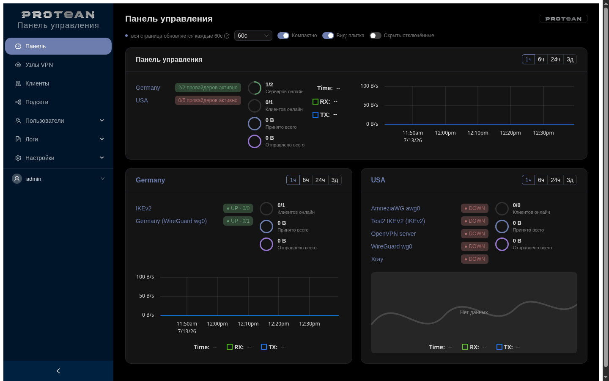
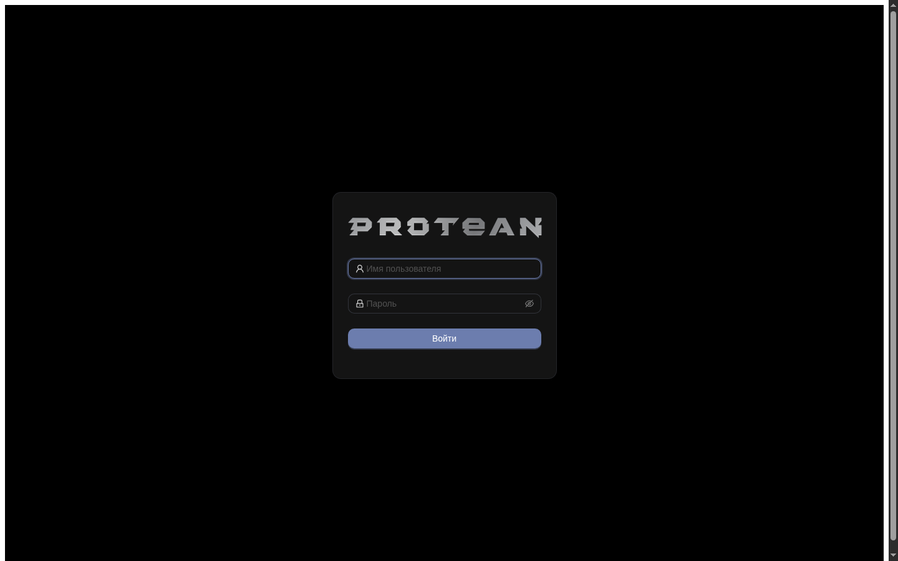
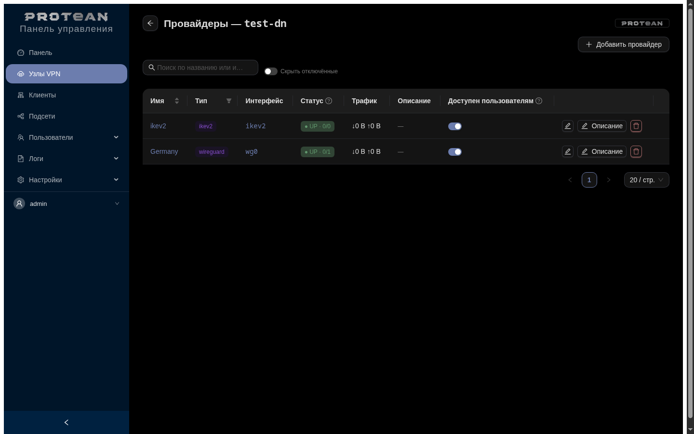
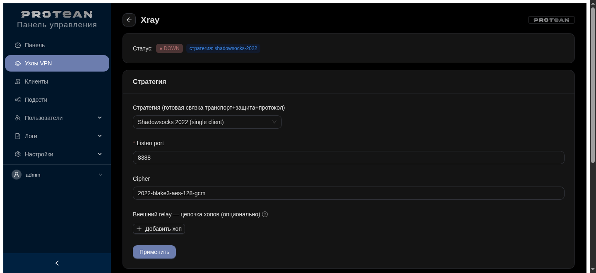
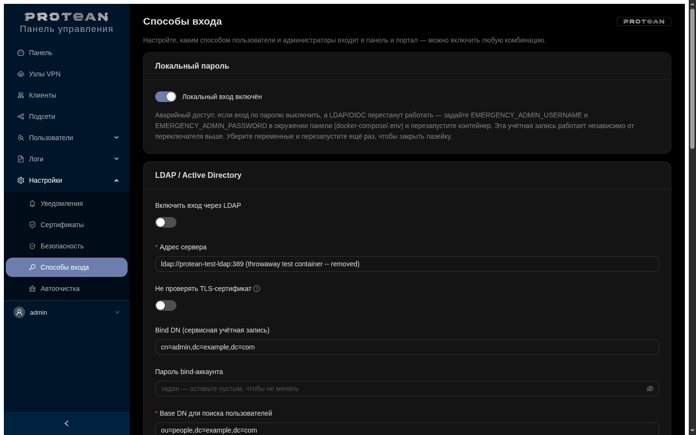

# Protean

[](go.mod)
[](docker-compose.yml)
[](LICENSE)


[English](README.md) | **Русский**

Универсальная web-панель для развёртывания и управления VPN на своих VPS:
WireGuard, AmneziaWG, OpenVPN, IKEv2/strongSwan и Xray (DPI-resistant,
Reality/VLESS/Shadowsocks/Trojan) — под одним UI, с объединением нескольких
площадок в одну сеть (site-to-site mesh), гибким выходом в интернет через
любую точку/страну (egress-relay через Xray) и индивидуальным доступом для
пользователей через портал самообслуживания. Название — от "protean"
(способный принимать разные формы): один инструмент под очень разные
сценарии — от простого site-to-site WireGuard до multi-hop DPI-resistant
egress. Заменяет ручную правку конфигов и `wg show`/`ipsec status` в
терминале дашбордом, формами и одной кнопкой "добавить клиента".

<p align="center">
  
</p>

<details>
<summary>Ещё экраны: вход, провайдеры сервера, Xray (DPI-resistant), LDAP/OIDC</summary>
<p align="center">
  
  
  <br>
  
  
</p>
</details>

## Что это не

Панель **не требует предустановленного VPN** — она умеет ставить
WireGuard/AmneziaWG/OpenVPN/IKEv2/Xray на целевой VPS сама, одной кнопкой
(страница Install, см. ниже), либо управлять уже существующей
VPN-инфраструктурой, если она у вас уже настроена руками. В обоих случаях
панель — это отдельный Docker-контейнер, который взаимодействует с хостом
только по SSH (никакого агента на хосте, никакого прямого доступа панели к
сети хоста в обход SSH).

## Как это работает

```
┌─────────────────────────────┐        SSH          ┌─────────────────────────────┐
│   Docker: панель (Go)        │ ───────────────────▶│   Хост (та же VPS)           │
│   - React + AntD SPA (API)   │  wg / wg-quick /     │   - wg0 (WireGuard)          │
│   - Postgres (auth, подсети, │    awg / awg-quick / │   - awg0 (AmneziaWG)         │
│     зашифрованные приватные  │    systemctl restart │   - /etc/wireguard/wg0.conf  │
│     ключи клиентов)          │                      │   - /etc/amnezia/.../awg0... │
└─────────────────────────────┘                      └─────────────────────────────┘
```

- **Источник истины по состоянию VPN — конфиг-файл на хосте**
  (`wg0.conf`/`awg0.conf`), а не база данных панели. Панель читает его и
  live-состояние интерфейса (`wg show <iface> dump`), решает, что менять, и
  пишет изменения обратно в тот же файл + применяет их живым `wg set`
  (без даунтайма, конфиг просто остаётся синхронизирован на случай рестарта).
- Имя клиента, которое не умеет хранить сам WireGuard, панель кладёт как
  комментарий `# Name: ...` прямо перед блоком `[Peer]` в conf-файле —
  так делают wg-easy/wireguard-ui, это тот же приём.
- В Postgres (в существующем на хосте контейнере, отдельная база/схема
  `wgpanel`) хранится только то, чего нет в conf-файле: пользователи панели,
  сессии, справочник "доступных подсетей" площадок и приватные ключи
  клиентов, которые панель сгенерировала сама (зашифрованы AES-256-GCM,
  ключ — `SECRET_KEY` из окружения) — нужны, чтобы отдавать конфиг/QR
  повторно после создания клиента.
- Провайдеры VPN — за интерфейсом `vpn.Provider` (`internal/vpn/provider.go`).
  WireGuard и AmneziaWG реализованы полностью и делят один и тот же код
  (`internal/vpn/wgfamily`), т.к. `awg`/`awg-quick` — форк `wg`/`wg-quick`
  с тем же форматом вывода и конфига плюс поля обфускации
  (Jc/Jmin/Jmax/S1/S2/H1-4). **OpenVPN** — полноценный провайдер: панель
  сама выступает CA (Go crypto/x509, ключ шифруется в БД), провижнит сервер
  (CA/cert/tls-crypt/conf/сервис) кнопкой «Set up», выдаёт клиентские
  `.ovpn`-бандлы с инлайн-сертификатами, маршрутизирует site-подсети через
  client-config-dir/iroute. **IKEv2/strongSwan** — тоже полноценный: своя CA,
  провижнинг swanctl кнопкой «Set up», клиенты — road-warrior с выдачей
  `.p12`-бандла (пароль показан в UI), статус по `swanctl --list-sas`.
  Для обоих cert-провайдеров: **отзыв сертификатов (CRL)** — удаление клиента
  ревокает его сертификат (OpenVPN `crl-verify`, strongSwan x509crl +
  `swanctl --load-all`), отозванный клиент больше не подключится; и **enroll по
  CSR** — клиент присылает CSR, панель подписывает, приватный ключ не покидает
  клиента (по аналогии с client-side keygen для WireGuard). Для IKEv2
  дополнительно: **per-client подсети площадок** (клиент-сайт получает свой
  swanctl-connection с `remote_ts` = его LAN, site-to-site) и **single-file
  профили** `.mobileconfig` (Apple) и `.sswan` (strongSwan Android) помимо
  `.p12` — отдельными ссылками на дашборде.
- **Несколько серверов (multi-server)**: панель управляет несколькими VPS.
  Серверы добавляются на странице **Узлы VPN** (SSH-реквизиты шифруются в БД,
  AES); каждый сервер держит свой набор провайдеров, ключ инстанса —
  `server:instance`. SSH-клиенты и провайдеры собираются на сервер и
  перерегистрируются в реестре на лету при добавлении/удалении (без рестарта).
  Существующая одно-серверная установка мигрирует автоматически: миграция
  переносит все ключи в сервер `default`, который сидируется из legacy `SSH_*`.
  Mesh — **пока по-серверно** (провайдеры внутри одного хоста).
- **Xray (DPI-resistant)**: модульный провайдер для враждебных сетей. Каждый
  **модуль** — один проверенный сквозной стек (transport+security+protocol),
  выбирается в UI: `reality-vless-tcp` (VLESS+Reality, макс. stealth),
  `vless-vision-tls`, `vmess-ws-tls` (CDN), `trojan-tcp-tls`, `shadowsocks-2022`,
  `vless-grpc-tls`. Секреты (UUID/Reality-ключи/пароли) генерируются и стабильны
  между применениями; панель выдаёт client-link. Не проходит — сменил модуль,
  applied. Установка xray — из панели (official Xray-install).
- **Egress-relay (цепочки туннелей)**: любой Xray-сервер может выпускать трафик
  **через другой сервер** (напр. за границей) — multi-hop `клиент → хаб →
  relay → интернет`. Relay настраивается вставкой client-link зарубежного
  сервера (VLESS/Reality/TLS/gRPC, Trojan, Shadowsocks) — панель парсит и строит
  Xray-outbound с routing всего трафика через relay.

## Единая сеть без NAT (cross-provider mesh)

Все транспорты (wg0, awg0) образуют **одну site-to-site сеть**. Клиент на
WireGuard и клиент на AmneziaWG видят друг друга и все подсети площадок, как
в одной L3-сети — без NAT, адреса сохраняются. Как это устроено:

- У каждого интерфейса свой туннельный CIDR (напр. wg0=10.10.0.0/24,
  awg0=10.20.0.0/24). Подсети площадок — **общий mesh-каталог** (не привязаны
  к провайдеру).
- В скачиваемый конфиг клиента панель кладёт AllowedIPs = **все туннельные
  сети + все подсети площадок минус его собственные**. Поэтому wg-клиент
  маршрутизирует трафик к awg-подсети в туннель → хаб → выход в awg0.
- Хаб форвардит между интерфейсами: панель пишет в `[Interface]` конфигов
  `PostUp/PostDown` с `iptables ... FORWARD ACCEPT` (**без MASQUERADE** —
  это site-to-site, NAT не нужен) плюс включает `ip_forward`.
- Панель запрещает **пересечение** туннельных сетей и подсетей между собой —
  без этого маршрутизация без NAT неоднозначна.
- Вкладка **«Обзор сети»** (на странице **«Клиенты»**) показывает все
  транспорты, туннельные CIDR, подсети, всех пиров обоих провайдеров и
  предупреждает о пересечениях; там же кнопка включения форвардинга
  (с рестартом интерфейса).

> Важно: на стороне площадки её LAN-роутер/хосты должны знать обратный
> маршрут в mesh через машину клиента (или клиент сам делает SNAT на своём
> LAN) — это вне зоны панели, см. DEPLOYMENT.md.

## Функционал

- **Дашборд** по каждому провайдеру: интерфейс up/down, endpoint, порт,
  публичный ключ, адрес, кол-во пиров/сколько онлайн, суммарный трафик;
  таблица пиров (имя, статус, текущий endpoint клиента — обычно серый
  IP из-за NAT, allowed-ips/подсети, последний handshake, rx/tx).
  Автообновление раз в 7 секунд без перезагрузки страницы.
- **Добавление клиента**: имя, авто-подсказка свободного адреса в
  туннельной подсети, выбор каких "площадок" (подсетей) клиент должен
  видеть, persistent keepalive. Ключи генерируются в самой панели (Go,
  без похода на хост), после сохранения — готовый `.conf` на скачивание и
  QR-код для мобильных клиентов.
- **Редактирование пира**: имя, набор подсетей, keepalive.
- **Disable/enable пира**: временно убрать с интерфейса без потери ключей и
  настроек, потом вернуть.
- **Rotate**: перегенерировать ключи пира (усыновление пиров, заведённых вне
  панели, или ротация при утечке).
- **Удаление пира**.
- **Мульти-инстанс**: несколько интерфейсов одного типа (wg0,wg1,… через
  `WG_INTERFACES`) — каждый отдельный дашборд/инстанс с независимыми mesh/egress
  (для multisite).
- **Срок действия пира**: авто-disable (wg) / удаление (cert) по истечении N
  дней — временный/гостевой доступ (фоновый воркер).
- **Client-side keygen** (wg): вставить свой публичный ключ — приватный не
  попадает на сервер (self-managed, без выгрузки конфига).
- **Настройки сервера**: ListenPort, Address, DNS, для AmneziaWG — ещё и
  параметры обфускации. Изменение требует рестарта интерфейса (панель
  предупреждает).
- **Подсети**: CRUD над общим mesh-каталогом подсетей площадок с проверкой
  на пересечение; выбираются при создании/редактировании пира и попадают в
  AllowedIPs клиентских конфигов по всему mesh.
- **Обзор сети**: вкладка на странице «Клиенты», сводка по всей сети
  (транспорты, туннельные CIDR, подсети, пиры обоих провайдеров,
  предупреждения о пересечениях, включение форвардинга).
- **Network (per-provider)**: у каждого VPN независимо — вступление в mesh
  (по умолчанию off, т.е. параллельный независимый туннель), выход в интернет
  через этот VPN (NAT + default route, по умолчанию off), и управление
  системным сервисом (start/stop/enable/disable — отключить неиспользуемый VPN
  ради экономии ресурсов).
- **Установка VPN из панели** (страница Install): панель определяет ОС/пакетный
  менеджер хоста и ставит выбранный VPN одной кнопкой. Реализовано безопасно —
  панель по SSH вызывает единственный **root-owned веттед скрипт**
  `/usr/local/lib/protean/protean-installer.sh` со строгим enum действий
  (`detect`/`install <provider>`), а не произвольные команды. Поддержка
  apt/dnf/pacman/zypper, настройка репозиториев AmneziaWG (PPA/DEB822/COPR/AUR),
  учёт SELinux, отказ на не-systemd системах.
- **Авторизация**: логин/пароль, серверные сессии в Postgres (HMAC-токены),
  CSRF-защита форм, смена пароля в `/account`, опциональная 2FA (TOTP) —
  включается пользователем на `/account`, по умолчанию выключена.
  **Админ-настраиваемая парольная политика** (мин. длина, требования к
  регистру/цифрам/символам, опциональный принудительный возраст пароля) —
  страница «Безопасность».
- **Защита от перебора паролей**: прогрессивные баны по логину и/или IP
  (эскалация длительности при повторных срабатываниях), админ-управляемые
  белый/чёрный список IP, статистика попыток входа — всё в UI, без правки
  конфигов.
- **LDAP и OIDC**: вход через внешнюю директорию (LDAP bind + поиск группы,
  fallback без `memberOf`) или OIDC/OAuth2-провайдер (authorization code +
  PKCE, любой совместимый — проверено на Keycloak), роль (`admin`/`user`)
  назначается по членству в группе, аккаунт заводится автоматически при
  первом входе. Есть аварийный локальный вход (`EMERGENCY_ADMIN_USERNAME/
  PASSWORD`) на случай недоступности внешнего провайдера — работает даже при
  отключённом обычном локальном входе, закрывается снятием переменных.
- **Роли и портал самообслуживания**: два уровня доступа — `admin` (полная
  панель) и `user` (только страница `/portal`, без доступа к остальной
  панели). Портальный пользователь видит все настроенные сети (админ решает,
  какие видимы), нажимает «Запросить доступ» — для WireGuard/AmneziaWG клиент
  создаётся автоматически, для OpenVPN/IKEv2 админ подтверждает и создаёт
  вручную; после базовой проверки корректности — доступен для скачивания
  конфиг/QR. Очередь запросов и решения — в админке.
- **История подключений**: персистентный (не только in-memory) журнал
  connect/disconnect по каждому клиенту, с настраиваемым сроком хранения.
- **Собственный HTTPS** (страница «Сертификаты»): панель поднимает TLS сама,
  без обязательного reverse proxy — self-signed сертификат генерируется
  автоматически при первом запуске (постоянный fallback, чтобы истечение
  ACME/ручного сертификата никогда не откатывало на HTTP и не рвало
  Secure-куки), либо: ACME (Let's Encrypt или любой совместимый сервер,
  включая приватные вроде step-ca), либо ручная загрузка cert+key, либо
  режим «за прокси» (TLS терминирует внешний Traefik/nginx).
- **RU/EN интерфейс**: переключатель языка в UI, вся панель (включая
  сообщения об ошибках API) — на выбранном языке.
- **Аудит**: страница `/audit` — журнал действий (создание/изменение/удаление
  пиров, настройки сервера, подсети, включение форвардинга, **скачивание
  клиентских конфигов/QR** — фиксируется утечка ключевого материала).
- **Уведомления** (`/notifications`): мгновенные события (интерфейс up/down,
  пир connect/disconnect — тумблеры) в Telegram / Mattermost / Rocket.Chat /
  VoceChat / XMPP, плюс **накопительный email-отчёт** с настраиваемой частотой
  и содержимым (статус + события). Каналы настраиваются в UI, секреты
  шифруются в БД (AES). Кнопка «Send test» на каждый канал.
  Тонкая настройка: **mute/unmute на каждого клиента** (кнопка 🔔/🔕 в строке
  пира — выбираешь, какие клиенты шлют события) и **тумблеры содержимого
  сообщения** (провайдер, source-endpoint, туннельный адрес, время).
  **Выбор событий по категории пира**: у пира есть категория —
  *site* (маршрутизатор/сервер) или *client* (роуминг-юзер) — и события
  connect/disconnect включаются отдельно для каждой категории (сайту важен
  disconnect, клиенту — connect). Плюс отдельный алерт **«подключился
  неизвестный пир»** (не заведён в панели — понять, не подключился ли чужой).
- **Метрики**: `/metrics` в Prometheus-формате (интерфейсы up/down, пиры
  всего/онлайн, rx/tx, per-peer handshake/трафик; плюс **host_up**, SSH
  commands/errors/latency, HTTP requests/errors/latency, Go runtime), под
  Bearer-токеном. Подходит для Zabbix HTTP-agent сразу и Prometheus/Grafana.
- **Healthz**: `/healthz` — БД обязательна (503 если недоступна); доступность
  хоста по SSH проверяется (кэш ~10s) и отражается как «host degraded» в теле
  ответа, но **не роняет** контейнер (удалённая проблема ≠ смерть панели).

## Технологии

Go (без CGO, один статический бинарь) · `pgx` для Postgres ·
`golang.org/x/crypto` (SSH, bcrypt, curve25519) · React + TypeScript + Ant
Design SPA (react-i18next для RU/EN), собирается Vite и встраивается в
бинарь через `go:embed` · `go-qrcode`.

## Быстрый старт

**Просто попробовать?** Панель разворачивается вместе со своим Postgres,
без подготовки хоста:

```
cp .env.standalone.example .env.standalone   # заполнить 4 обязательных значения
docker compose -f docker-compose.standalone.yml --env-file .env.standalone up -d --build
```

Дальше открываешь `https://localhost:8080` (self-signed сертификат, браузер
предупредит при первом заходе — это нормально) и добавляешь первый VPN-хост
на странице **Узлы VPN** — панель подключится к нему по SSH и сама сможет
поставить VPN. Полное описание — в комментариях в начале
[docker-compose.standalone.yml](docker-compose.standalone.yml).

**Разворачиваем по-настоящему**, панель и VPN на одном VPS, с уже
существующим контейнером Postgres:

1. На целевом VPS (там, где будет крутиться и WireGuard, и панель):
   ```
   sudo ./scripts/setup-host.sh
   ```
   Ставит выбранные VPN (WireGuard/AmneziaWG/OpenVPN/IKEv2/Xray —
   все полноценно управляются панелью), заводит
   системного пользователя `protean` с SSH-ключом и точечными sudo-правами,
   выставляет права на conf-файлы, включает IP forwarding, создаёт БД в
   уже работающем Postgres-контейнере, генерирует `.env`.
2. Переносишь то, что скрипт положил в `/root/protean-deploy/`, в репозиторий
   деплоя: `id_ed25519` → `./secrets/id_ed25519`, `panel.env` → `./.env`.
3. Проверяешь и правишь `docker-compose.yml` (сеть Postgres) — см. **DEPLOYMENT.md**.
4. `docker compose build && docker compose up -d`.
5. Заходишь по HTTPS (панель поднимает его сама — self-signed сертификат
   сразу после первого запуска, см. страницу «Сертификаты» насчёт ACME/
   ручного сертификата/режима «за прокси») и логинишься
   `ADMIN_USERNAME`/`ADMIN_PASSWORD` из `.env`.

Полный чеклист, что скрипт не делает и что нужно проверить/поправить руками —
в **[DEPLOYMENT.md](DEPLOYMENT.md)**.

## Документация

- [docs/GETTING-STARTED.md](docs/GETTING-STARTED.md) — обзор + быстрый старт
- [docs/USER-GUIDE.md](docs/USER-GUIDE.md) — руководство оператора
- [docs/DEVELOPER-GUIDE.md](docs/DEVELOPER-GUIDE.md) — архитектура и разработка
- [docs/OPERATIONS.md](docs/OPERATIONS.md) — эксплуатация (SRE-runbook)

## Известные ограничения

- **Cross-host mesh** (связь площадок на разных серверах между собой напрямую)
  пока не реализован — mesh работает в пределах одного хоста; объединение
  разных VPS в одну сеть без промежуточного релея — открытый пункт (multi-hop
  egress через Xray между серверами уже работает, это отдельная вещь).
- AmneziaWG ставится из панели на apt (PPA/DEB822), dnf (COPR) и Arch (нужен
  AUR-хелпер yay/paru); на openSUSE официального пакета нет — установка руками.
- Поддерживаются только systemd-дистрибутивы (apt/dnf/pacman/zypper). На
  не-systemd (Artix/Devuan-sysvinit/Alpine) установка из панели недоступна.
- Форвардинг-правила используют `iptables` (через nft-совместимый шим на
  современных дистрибутивах); на чисто-nftables системах без `iptables-nft`
  правила нужно адаптировать вручную.
- SSH-пользователь панели читает тот же conf-файл, где лежит приватный
  ключ сервера WireGuard/AmneziaWG — осознанный компромисс ради простоты
  модели прав, подробности и обоснование — в DEPLOYMENT.md.

## Есть ли уже что-то похожее?

Панелей под один протокол хватает — wg-easy/wireguard-ui для WireGuard,
3x-ui/Marzban для Xray. Сочетания, которое мы не встречали в готовом виде:
пять разных протоколов под одной моделью инстансов и ролей, с mesh поверх
любого из них и общим порталом самообслуживания для всех сразу. Это узкое
утверждение именно про эту комбинацию, не утверждение что аналогов нет
вообще — рынок большой, могли просто не найти.

## Лицензия

[Elastic License 2.0](LICENSE) — source-available, формально не
open source (не OSI-approved). Простыми словами: можно свободно
использовать, самостоятельно разворачивать, менять и применять
коммерчески (в том числе внутри компании, для своей инфраструктуры).
Нельзя — разворачивать это как хостинг/managed-сервис и продавать
доступ третьим лицам. Точные условия — в файле LICENSE.
